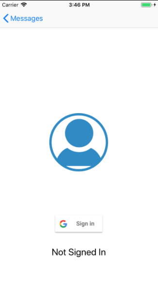
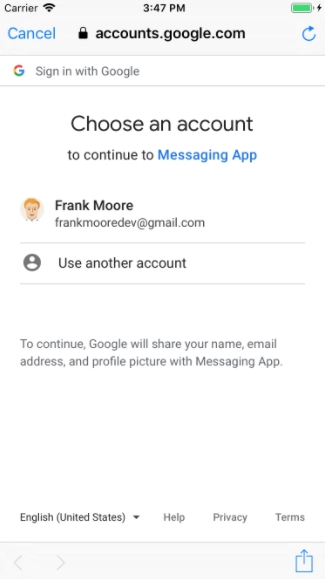
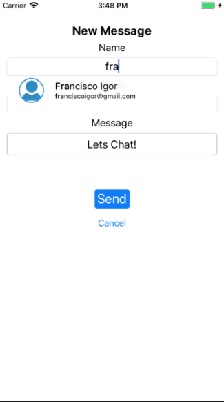
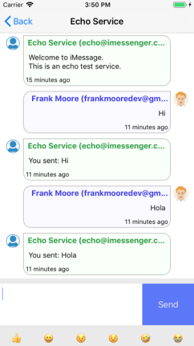
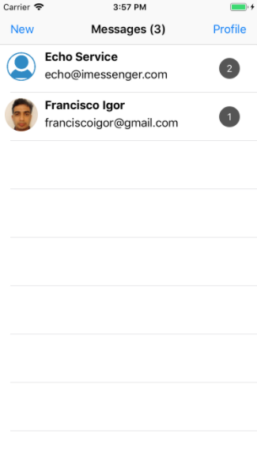
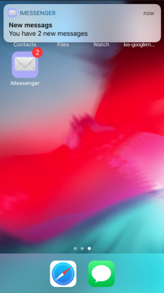

# iMessenger

An iOS Messaging application

## Features

* User authentication using a Google Account
* Receive messages in real-time
* Send messages using your contact list from Google account
* Uses an open chat API to provide message exchange 
* Echo service to test communication

## Screenshots

<kbd></kbd>
<kbd></kbd>

<kbd></kbd>
<kbd></kbd>

<kbd></kbd>
<kbd></kbd>

## Components used

### External Components

* CoreData
  * Permant storage for API data (Messages, Contacts, Conversations)
* SplitViewController
  * Navigation betwen views, dual view for Conversations/Messages in large screens.
* UserNotifications
  * Local notifications for new messages, update badge for number of messages pending
* Cocoa Pods
  * GoogleSignIn : Provides Google authentication and contact services
  * DateToolsSwift : Provides human readable date/time for messages (An hour ago, Just now)
  * SearchTextField : Provides auto-complete functionality to the Contact search for new messages.

### Application Components

* DataSource
  * Json data convert and processing
  * Generic Library for API Access
  * Local storage for API results using CoreData
  * Realtime update of Entities
* AppData
  * Chat API client Implementation
  * Data services for the application (Models, Filters, Operations)
* Back-end API 
  * Google authentication / validation
  * Remote storage for messages and contacts
  
  
  
  

